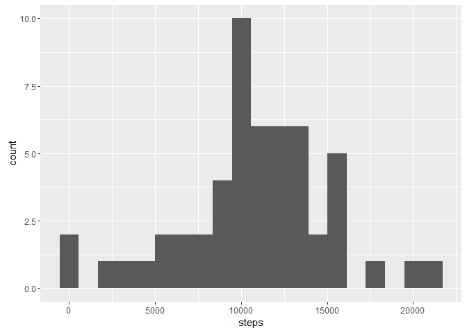
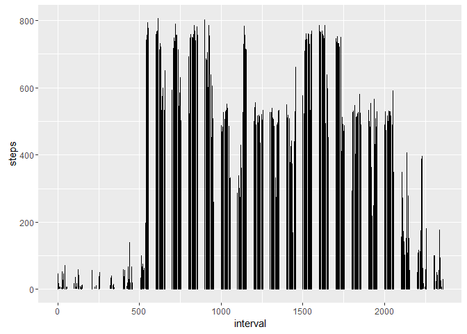
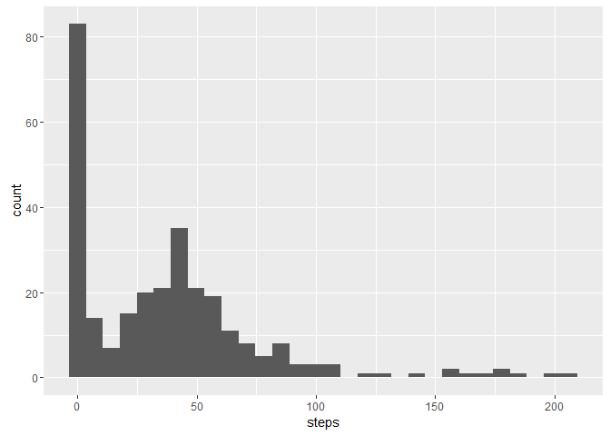
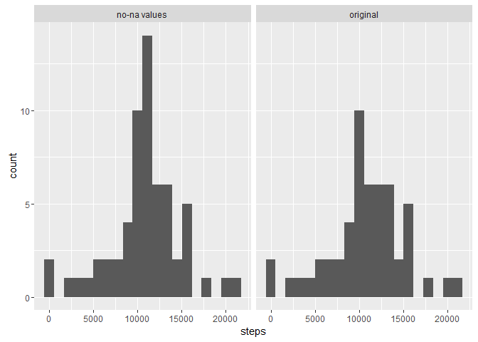

# Reproducible Research: Peer Assessment 1
Jeff Collier  


## Loading and preprocessing the data

Loading the data into a data frame called "activity". Data is located in a local directory and is unzipped using unz before reading


```r
activity <- read.csv(unz("./activity.zip", filename="activity.csv"))
```
## What is mean total number of steps taken per day?
In the following histogram, I am ignoring the missing values in the dataset and creating a histogram related to steps/interval. First the daily steps are calculated then the historgram is created


```r
daily <- aggregate(steps ~ date, data = activity, sum)

g <- ggplot(daily, aes(steps))
g + geom_histogram(bins = 20)
```

<!-- -->

The following calculates and report the mean and median of the total number of steps taken per day


```r
mean(daily$steps)
```

```
## [1] 10766.19
```

## What is the average daily activity pattern?

```r
g <- ggplot(activity, aes(x = interval, y = steps))
g + geom_line()
```

<!-- -->

```r
maxSteps <- activity[!is.na(activity$steps) & activity$steps == max(activity$steps, na.rm = T),]
maxSteps
```

```
##       steps       date interval
## 16492   806 2012-11-27      615
```

## Imputing missing values

```r
missing <- sum(is.na(activity$steps))
missing
```

```
## [1] 2304
```

```r
percentMissing <- missing / nrow(activity)
percentMissing
```

```
## [1] 0.1311475
```
I manipulated the data a bit to get some basic information about where the NAs might be.


```r
dates <- unique(activity$date)
length(dates)
```

```
## [1] 61
```

```r
dim(daily)
```

```
## [1] 53  2
```
I find 61 unique dates but only 53 for which I can get a mean number of steps, perhaps because the entire day is NA. Next I attempt to replace NA with the average per time interval rather than per day.


```r
intervals <- aggregate(steps ~ interval, data = activity, mean)
dim(intervals)
```

```
## [1] 288   2
```

```r
head(intervals)
```

```
##   interval     steps
## 1        0 1.7169811
## 2        5 0.3396226
## 3       10 0.1320755
## 4       15 0.1509434
## 5       20 0.0754717
## 6       25 2.0943396
```

```r
ggplot(intervals, aes(steps)) + geom_histogram(bins = 30)
```

<!-- -->

The number of intervals is 288 which is what we would expect for a full 24 hour day with 5 minute intervals. Looking further I see that the first few intervals have a very small number of steps but a histogram shows that many intervals have a large number of steps and there seem to be two central areas one around 40ish steps and another around 0. This seems very consistent with expected life patters, So I'm going to use the interval mean to replace NAs.


```r
activity.nona <- activity %>%  
  group_by(interval) %>% 
  mutate(steps = ifelse(is.na(steps), mean(steps, na.rm=TRUE), steps))

any(is.na(activity))
```

```
## [1] TRUE
```

```r
any(is.na(activity.nona))
```

```
## [1] FALSE
```

```r
activity.nona <- as.data.frame(activity.nona)

daily.nona <- aggregate(steps ~ date, data = activity.nona, sum)
daily$category <- "original"
daily.nona$category <- "no-na values"
daily.plot <-rbind(daily, daily.nona)

g <- ggplot(daily.plot, aes(steps))
g + geom_histogram(bins = 20) + facet_grid(.~category)
```

<!-- -->

As evidenced by the test for NA values and the histogram, we now have a set of data without NAs values, but it retains the same basic distribution of our original data, as shown in the histogram. The non na dataset overall has larger step counts which is what we would expect since we added more data.

## Are there differences in activity patterns between weekdays and weekends?


```r
activity.nona$days <- weekdays(as.Date(activity.nona$date))

activity.nona$days <- ifelse(
  weekdays(as.Date(activity.nona$date)) == "Saturday" |
  weekdays(as.Date(activity.nona$date)) == "Sunday", 
  "Weekend", "Weekday")

avgWeekend <- aggregate(steps ~ interval, 
                data = activity.nona[
                  activity.nona$days == "Weekend",], mean)
avgWeekend$category <- "Weekend"

avgWeekday <- aggregate(steps ~ interval, 
                data = activity.nona[
                  activity.nona$days == "Weekday",], mean)
avgWeekday$category <- "Weekday"

avg.plot <- rbind(avgWeekday, avgWeekend)

g <- ggplot(avg.plot, aes(x = interval, y = steps))
g + geom_line() + facet_grid(category~.)
```

<!-- -->

From these plots it seems that the participants were less active in the middle of the day during typical work hours. There also seems to be more activity at the begining of the weekdays compared to the weekend data. It seems as though the weekends are more active overall but its difficult to gauge from just this graph.
