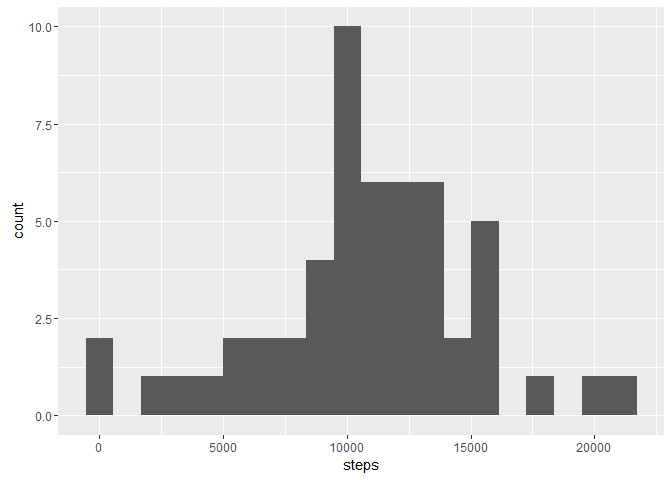

# Reproducible Research: Peer Assessment 1


## Loading and preprocessing the data
Loading the data into a data frame called "activity"

```r
activity <- read.csv(unz("./activity.zip", filename="activity.csv"))
```

Process/transform the data  into a format suitable for your analysis


## What is mean total number of steps taken per day?
For this part of the assignment, I am ignoring the missing values in the dataset.

Calculate the total number of steps taken per day

```r
require(ggplot2)
```

```
## Loading required package: ggplot2
```

```
## Warning: package 'ggplot2' was built under R version 3.3.1
```

```r
daily <- aggregate(steps ~ date, data = activity, sum)

g <- ggplot(daily, aes(steps))
g + geom_histogram(bins = 20)
```

<!-- -->

Calculate and report the mean and median of the total number of steps taken per day

```r
mean(daily$steps)
```

```
## [1] 10766.19
```

## What is the average daily activity pattern?


## Imputing missing values


## Are there differences in activity patterns between weekdays and weekends?
